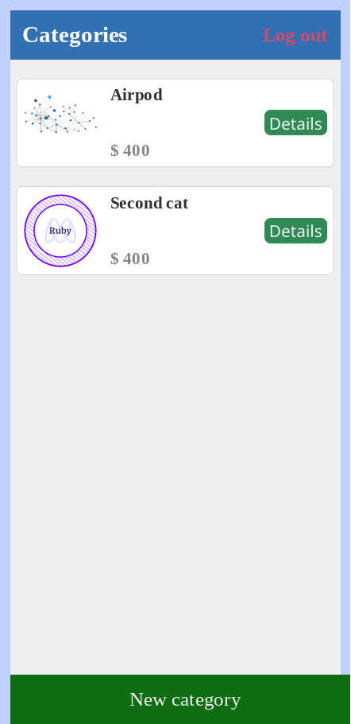
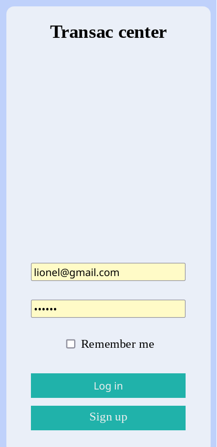

# Transac_Center

# Live demo
[Transac_center](https://pacific-taiga-56560.herokuapp.com)

# Preview



## Built With

- Ruby on Rails
- PostgreSQL

## Getting Started

To get a local copy up and running follow these simple example steps.

### Prerequisites

- [Ruby](https://www.ruby-lang.org/en/)
- [Rails](https://gorails.com/)

### Setup

- Make sure you have Ruby on Rails set up properly on your computer
- Clone or download this repo on your machine
- Enter project directory

### Development Database

```sh
# Create user
sudo -u postgres createuser -e ced00 -s
# Load the schema
rails db:schema:load
# Create the database
rake db:create
# Run database Migration
rails db:migrate
```

### Install

```sh
bundle install
```

### Run server

```sh
rails s
```

### Test

```sh
rspec
```

## Author

👤 **Cédric Kossi**

- GitHub: [@kosher9](https://github.com/kosher9)
- Twitter: [@kosherus](https://twitter.com/kosherus)
- LinkedIn: [LinkedIn](https://linkedin.com/in/lionel-c%C3%A9dric-kossi-323042172)

## 🤝 Contributing

Contributions, issues, and feature requests are welcome!

Feel free to check the [issues page](../../issues/).

## Show your support

Give a ⭐️ if you like this project!

## Acknowledgments

- Design inspired by [Gregoire Vella](https://www.behance.net/gregoirevella)

## 📝 License

This project is [MIT](./MIT.md) licensed.
